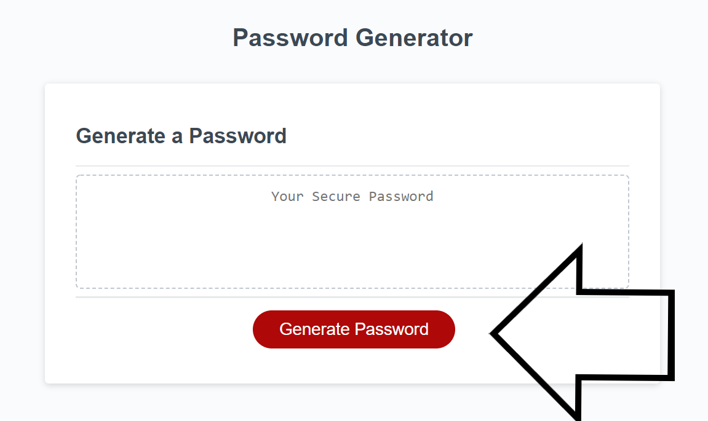
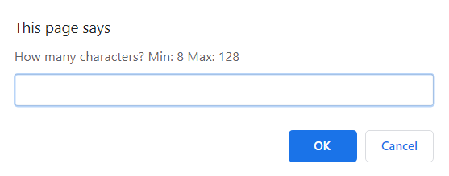
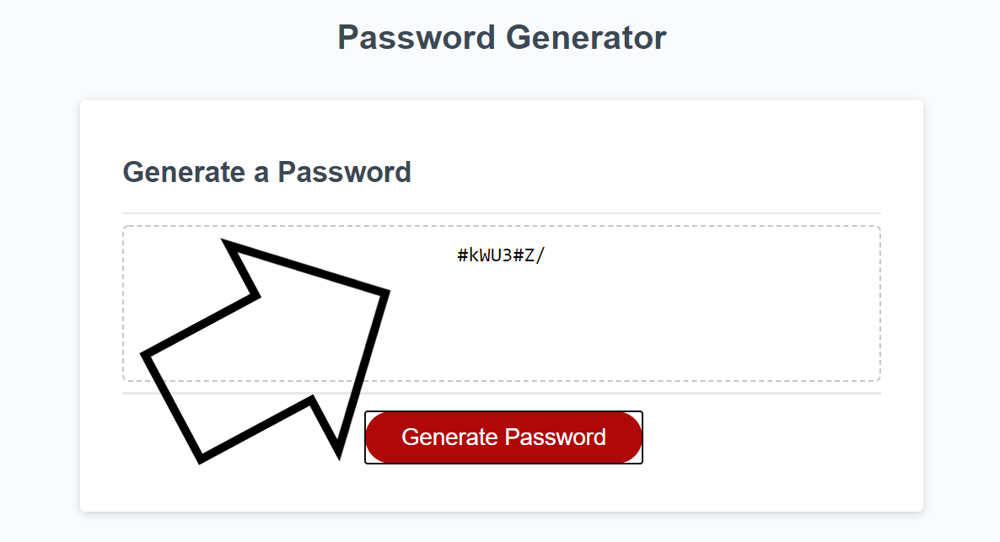

# Password Generator Javascript

## Random Password Generator

### Overview:
In this repository I created a random password generator.  The generator is designed to take information given by the user and with this information give a password that meets the user's requirements.  The Criteria used in the password are password length, and whether you wanna use lowercase letters, uppercase letters, numbers, and/or special characters. This was primarily accomplished using Javascript prompts, for loops, functions, and if/else statements.  

## How it works!

### The process goes Like this:
### Click Generate Password Button

### Answer Prompts

### View Generated Password

### Example
Here is a link to the Generator:  [https://vfavorito.github.io/password-generator/](https://vfavorito.github.io/password-generator/)

### Installation
To install this project simply clone this repository to your local directory and access it using Visual Studio Code

### License
Copyright <2020> < Vincent Favorito >

Permission is hereby granted, free of charge, to any person obtaining a copy of this software and associated documentation files (the "Software"), to deal in the Software without restriction, including without limitation the rights to use, copy, modify, merge, publish, distribute, sublicense, and/or sell copies of the Software, and to permit persons to whom the Software is furnished to do so, subject to the following conditions:

The above copyright notice and this permission notice shall be included in all copies or substantial portions of the Software.

THE SOFTWARE IS PROVIDED "AS IS", WITHOUT WARRANTY OF ANY KIND, EXPRESS OR IMPLIED, INCLUDING BUT NOT LIMITED TO THE WARRANTIES OF MERCHANTABILITY, FITNESS FOR A PARTICULAR PURPOSE AND NONINFRINGEMENT. IN NO EVENT SHALL THE AUTHORS OR COPYRIGHT HOLDERS BE LIABLE FOR ANY CLAIM, DAMAGES OR OTHER LIABILITY, WHETHER IN AN ACTION OF CONTRACT, TORT OR OTHERWISE, ARISING FROM, OUT OF OR IN CONNECTION WITH THE SOFTWARE OR THE USE OR OTHER DEALINGS IN THE SOFTWARE.

